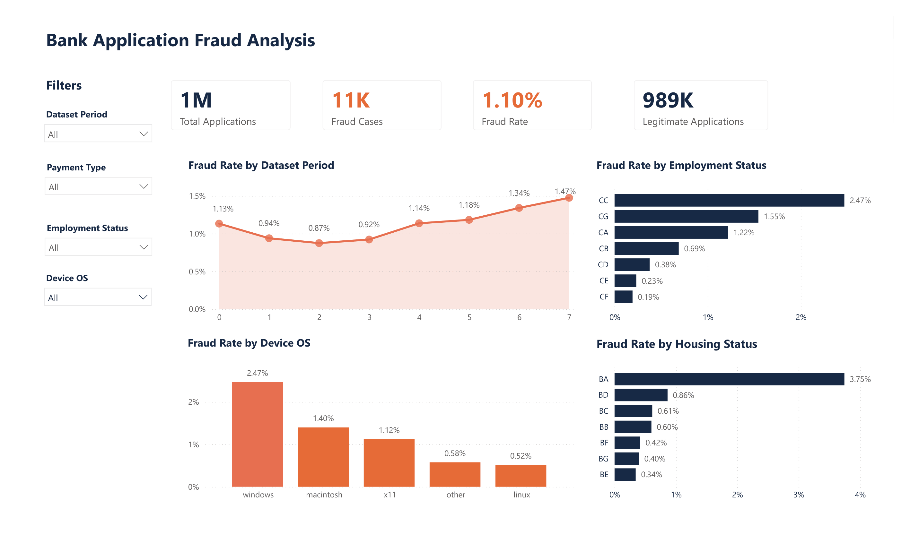
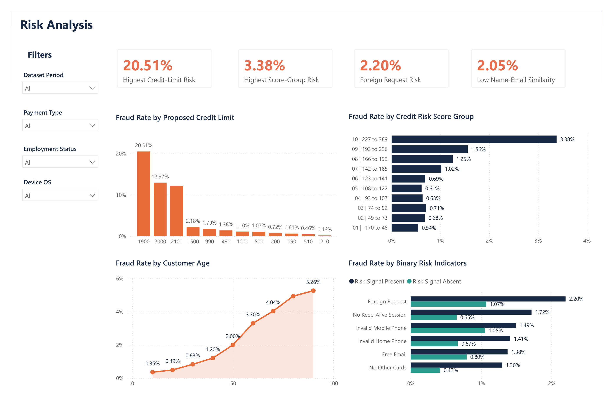

# Bank Application Fraud Analysis

This project analyzes 1 million bank application records to understand fraud patterns and identify the factors associated with higher fraud rates.

I used Python for data cleaning and exploratory analysis, SQL Server for structured analysis, and Power BI to build an interactive two-page dashboard.

## Project Workflow

1. Cleaned and explored the dataset using Python and Pandas.
2. Imported the cleaned dataset into Microsoft SQL Server.
3. Used SQL to calculate fraud rates across different customer and application characteristics.
4. Connected Power BI to SQL Server.
5. Built an interactive Fraud Overview page and Risk Analysis page.

## Dashboard

### Fraud Overview

The Fraud Overview page summarizes the overall fraud level and compares fraud rates by:

- Dataset period
- Device operating system
- Employment status
- Housing status

### Risk Analysis

The Risk Analysis page focuses on higher-risk application characteristics, including:

- Proposed credit limit
- Credit-risk score group
- Customer age
- Foreign requests
- Email and phone indicators
- Session and card-related indicators

## Key Findings

- The dataset contains 1,000,000 applications.
- 11,029 applications were fraudulent, giving an overall fraud rate of 1.10%.
- The fraud rate increased from 0.87% in dataset period 2 to 1.47% in period 7.
- Windows applications had the highest device-level fraud rate at 2.47%.
- Housing status BA had the highest housing-related fraud rate at 3.75%.
- Employment status CC had the highest employment-related fraud rate at 2.47%.
- A proposed credit limit of 1,900 had the highest fraud rate at 20.51%, although this category contained only 390 applications.
- The highest credit-risk score group had a fraud rate of 3.38%.
- Applications with a foreign request had a fraud rate of 2.20%, compared with 1.07% when the signal was absent.
- Fraud rates generally increased across the customer-age groups.

## Tools Used

- Python
- Pandas
- Matplotlib
- Seaborn
- Microsoft SQL Server
- T-SQL
- Power BI
- Power Query
- DAX

## SQL Analysis

The SQL analysis includes:

- Overall fraud KPIs
- Fraud trends by dataset period
- Fraud rates by device OS, employment status, and housing status
- Proposed credit-limit analysis
- Credit-risk score grouping using CTEs and CASE expressions
- Binary risk-indicator analysis using CROSS APPLY
- Final data-quality checks

## Repository Files

| File | Description |
|---|---|
| `bank_application_fraud_analysis.ipynb` | Python cleaning and exploratory analysis |
| `bank_fraud_analysis.sql` | SQL queries used for fraud and risk analysis |
| `Bank_Application_Fraud_Analysis-1.png` | Fraud Overview dashboard |
| `Bank_Application_Fraud_Analysis-2.png` | Risk Analysis dashboard |
| `README.md` | Project documentation |

## Power BI Report

The Power BI file is available from the repository's Releases section:

[Download the Power BI dashboard](https://github.com/shathaalkhammash/bank-application-fraud-analysis/releases/latest)

The report contains imported data for viewing the dashboards. Refreshing the data source requires access to a local SQL Server database with the same table structure.

## Dataset

The project uses the Feedzai Bank Account Fraud Dataset Suite. The data contains anonymized bank application records and a binary fraud label.

Some categorical values are encoded in the original dataset, and the dataset-period field represents numbered periods rather than calendar months.
